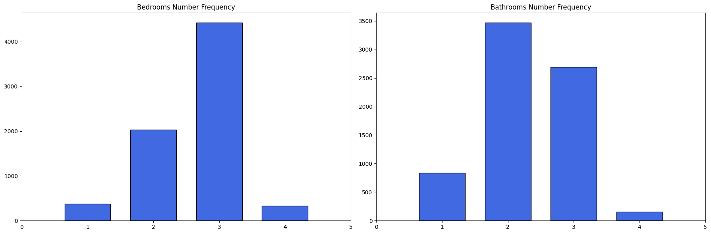

# **Bayut Egypt Real Estate Website Data Analysis Project:**

## **(1) Introduction:**
This project focuses on a detailed data analysis of the **real estate marke** in **Cairo** governorate, specifically the **apartment typ**e. The primary objective is to uncover valuable insights and trends within the market, specifically focusing on aspects such as **the most common configurations of bedrooms and bathrooms**, **frequently occurring apartment areas by square meter, and the relationship between district locations and pricing metric**, also **understanding the distribution of apartment sizes**, and **evaluating districts based on median prices and price per square meter**. The project also aims to highlight districts offering the best value in terms of pricing and explore **correlations between apartment areas and median prices**.

The project **workflow** begins with **web scraping** using **Python** libraries such as **BeautifulSoup and Selenium** to gather data from **the Bayut Egypt real estate website**. This raw data is then exported into a **CSV file** for subsequent processing. The next phase involves **data cleaning, formatting, and standardization using Pandas and NumPy libraries**, addressing issues such as **duplicate values, outliers, and null values**. The cleaned dataset is then exported to a **CSV file** for exploratory data analysis (EDA).

For **exploratory data analysis (EDA)**, the project employs **Python libraries like Matplotlib** to create visualizations, conducting both **univariate and bivariate analyses** to understand data distributions and relationships. Then I used **Power BI** to develop a **dynamic dashboard** that clearly represents the trends and insights derived from the data.

## **(2) Tools I Used:**
1. **Web Scraping Python Libraries (Beautifulsoup -  selenium):** for automatically extracting data from Real Estate Website.
2. **Pandas Library:** Utilized for data cleaning, manipulation, standardization (normalization), and handling outliers and null values.
3. **Matplotlib:** Employed for data visualization.
4. **Power BI:** For creating dynamic and interactive dashboards.
5. **GitHub:** For sharing my analysis and insights.

## **(3) Project Roadmap:**
1. **Web Scraping** to **Bayut Egypt** Real Estate Website Using Python Libraries **(Beautifulsoup -  selenium)**.

2. **Data Cleaning, Formatting and Standardization** Using Python.

3. Exploratory Data Analysis **(EDA)** Using Python:

    **3.1. Univariate Exploratory Data Analysis (EDA):** Use visualizations and statistical summaries.

    **3.2. Bivariate Exploratory Data Analysis (EDA):** Explore relationships with scatter plots and correlation matrices.

4. Dynamic Dashboard Using **Power BI**.

5. Find **Insights** and **Trends**.

## **(4) Web Scraping: Extracting Real Estate Data from Bayut Egypt Website:**
I used **Python** libraries such as **BeautifulSoup and Selenium** for automated real estate data extraction from the Bayut Egypt website. This process enabled us to gather valuable attributes to apartment real estate type, such as **(Real_Estate_Type, Location, Price, Down_Payment, Currency, 	Bedrooms_Number, Bathrooms_Number, Area, Description)**, then extracted this dataset to **CSV** file for subsequent processing. 

**Automated Python Code to Extract Real Estate Attributes: (Real_Estate_Type, Location, Price, Down_Payment, Currency, 	Bedrooms_Number, Bathrooms_Number, Area, Description):**
```py
import pandas as pd
from selenium import webdriver
from selenium.webdriver.chrome.service import Service
from webdriver_manager.chrome import ChromeDriverManager
from bs4 import BeautifulSoup
import time

page_link = f'https://www.bayut.eg/en/cairo/apartments-for-sale/?completion_status=ready'
second_page_link = 'https://www.bayut.eg/en/cairo/apartments-for-sale/page-2/?completion_status=ready'

links = []

for index in range(515):
    links.append(f"https://www.bayut.eg/en/cairo/apartments-for-sale/page-{index + 2}/?completion_status=ready")

def bayut_egypt(link, link_2=[]):
    try:
        selenium_service = Service(ChromeDriverManager().install())
        browser = webdriver.Chrome(service=selenium_service)

        browser.get(link)
        time.sleep(5)

        currency_list = []
        price_list = []
        real_estate_type_list = []
        bedrooms_number_list = []
        bathrooms_number_list = []
        area_list = []
        location_list = []
        down_payment_list = []
        description = []

        apartments = browser.find_elements('class name', 'a37d52f0')
        for apartment in apartments:
            html_code = apartment.get_attribute('outerHTML')
            page_soup = BeautifulSoup(html_code, 'html.parser')
            currency_list.append(page_soup.find('span', {'class', '_06f65f02'}).text)
            price_list.append(page_soup.find('span', {'class' : 'dc381b54'}).text)
            real_estate_type_list.append(page_soup.find('div', {'class' : '_948d9e0a d05e0d48'}).span.span.text) 

            rooms_number = page_soup.find_all('span', {'class' : '_1822ec30 f34d293d'})
            bedrooms_number_list.append(rooms_number[1].text)
            bathrooms_number_list.append(rooms_number[2].text)

            area_list.append(page_soup.find('h4', {'class' : 'cfac7e1b _85ddb82f'}).text)
            location_list.append(page_soup.find('h3', {'class' : '_4402bd70'}).text)

            try:
                down_payment_list.append(page_soup.find('span', {'class' : '_41163454'}).text)
            except:
                down_payment_list.append('None')

            try:
                description.append(page_soup.find('h2', {'class' : 'f0f13906'}).text)
            except:
                description.append('None')

        selenium_service_2 = Service(ChromeDriverManager().install())
        browser_2 = webdriver.Chrome(service=selenium_service_2)
        for link in link_2:                                                   
            browser_2.get(link)
            time.sleep(1)

            apartments_2 = browser_2.find_elements('class name', 'a37d52f0')
            for apartment_2 in apartments_2:
                html_code_2 = apartment_2.get_attribute('outerHTML')
                page_soup_2 = BeautifulSoup(html_code_2, 'html.parser')
                currency_list.append(page_soup_2.find('span', {'class', '_06f65f02'}).text)
                price_list.append(page_soup_2.find('span', {'class' : 'dc381b54'}).text)
                real_estate_type_list.append(page_soup_2.find('div', {'class' : '_948d9e0a d05e0d48'}).span.span.text) 

                rooms_number_2 = page_soup_2.find_all('span', {'class' : '_1822ec30 f34d293d'})
                bedrooms_number_list.append(rooms_number_2[1].text)
                bathrooms_number_list.append(rooms_number_2[2].text)

                area_list.append(page_soup_2.find('h4', {'class' : 'cfac7e1b _85ddb82f'}).text)
                location_list.append(page_soup_2.find('h3', {'class' : '_4402bd70'}).text)

                try:
                    down_payment_list.append(page_soup_2.find('span', {'class' : '_41163454'}).text)
                except:
                    down_payment_list.append('None')

                try:
                    description.append(page_soup_2.find('h2', {'class' : 'f0f13906'}).text)
                except:
                    description.append('None')


        df_dictionary = {
            "Real_Estate_Type" : real_estate_type_list,
            "Location" : location_list,
            "Price" : price_list,
            "Down_Payment" : down_payment_list,
            "Currency" : currency_list,
            "Bedrooms_Number" : bedrooms_number_list,
            "Bathrooms_Number" : bathrooms_number_list,
            "Area" : area_list,
            "Description" : description
        }

        df = pd.DataFrame(df_dictionary)

        return(df.to_csv('bayut_egypt.csv', index=False))
    
    except Exception as error:
        print(f'Error With -bayut_egypt- Function: {error}')
```

## **(5) Data Cleaning, Formatting and Standardization:**
This phase transforms the **raw, scraped data** into a **reliable** and **analysis-ready** dataset. The process begins with **standardizing column structures and removing invalid data by handling duplicates, columns data type casting, and normalizing categorical values into meaningful descriptions**. Finally, the dataset is refined by filtering **outliers, imputing missing values, and creating new derived features** to improve our **exploratory data analysis**.

### **5.1. Standardize Column Names to Lowercase:**
```py
df_copy.columns = df_copy.columns.str.lower().str.strip()
```
### **5.2. Delete Columns (currency - description) As They Do Not Benefit In Analysis:**
```py
df_copy.drop(
    columns=['currency', 'description'],
    inplace=True
)
```
### **5.3. Ensure the Area is Consistent in "Sq. M" (Area Column Standarization):**
```py
print(df_copy['area'].str.contains('Sq. FT.').unique()) # [False]
print(df_copy['area'].str.contains('Sq. Ft.').unique()) # [False]
```

### **5.4. Dealing With Duplicated Values:**
- **Explore duplicated values:**
```py
int(df_copy.duplicated().sum()) # 4372
```
```py
duplicated_rows = df_copy[df_copy.duplicated(
    ['real_estate_type', 'location','price', 'bedrooms_number', 'bathrooms_number','area'],
    keep=False
) == True].sort_values(
    ['real_estate_type', 'location','price', 'bedrooms_number', 'bathrooms_number','area'],
    ascending=True
) # 7537 rows × 7 columns
```
- **We will remove all duplicated values but, with keeping the first occurrence values:**
```py
df_copy = df_copy.drop_duplicates(
    subset=['real_estate_type', 'location','price', 'bedrooms_number', 'bathrooms_number','area'],
    keep='first'
)
```
### **5.5. Columns Data Type Casting:**
**5.5.1. Convert "price" Column Data Type From Object to Float:**
```py
df_copy['price'] = df_copy['price'].str.replace(',', '').astype('float')
```

**5.5.2. Convert "bedrooms_number" Column Data Type From Object to Integer:**
**Data Cleaning Note: Normalizing "bedrooms_number" Column:**

Before converting the column **bedrooms_number** from object to **integer**, we shoud normalize the **Studio** values. In real estate terminology, a **Studio** apartment implies **1** bedroom. So I replaced all instances of **Studio** with **1** for consistency.

```py
df_copy['bedrooms_number'] = df_copy['bedrooms_number'].str.replace('Studio', "1").astype('int')
```

### **5.6. Data Normalization and Standardization to Map Coded Values to Meaningful, User-Friendly Descriptions:**
**5.6.1. Location Column Normalization:**

**(1) Data Cleaning Note: Splitting Location into District and Governorate:**

The location column contains values where the **last comma** separates the administrative hierarchy: **[District], [Governorate]**. So we will create two separate columns depending on the last **","** the first is the district, and the second is governorate.
```py
df_copy['governorate'] = df_copy['location'].str.rsplit(',', n=1, expand=True)[1].str.strip()
```
```py
df_copy['district'] = df_copy['location'].str.rsplit(',', n=1, expand=True)[0].str.strip()
```
```py
df_copy['district'] = df_copy['district'].str.replace(',', ' -')
```

**(2) Remove Main Location Column:**
```py
df_copy.drop(
    columns='location',
    inplace=True
)
```

**5.6.2. Area Column Normalization:**

**(1) Split the value of the area from the unit (Sq. M.):**
```py
df_copy['area_m2'] = df_copy['area'].str.split(' ', n=1, expand=True)[0].str.strip()
```
**(2) Remove the Main Area Column:**
```py
df_copy.drop(
    columns='area',
    inplace=True
)
```
**(3) Data Type Casting to Column Area from Object to Float:**
```py
df_copy['area_m2'] = df_copy['area_m2'].str.replace(',', '').astype('float')
```

### **5.7. Reorder Columns to Make Them More Meaningful and User-Friendly:**
```py
new_column_order = ['real_estate_type', 'district', 'governorate', 'area_m2', 'bedrooms_number', 'bathrooms_number', 'price', 'down_payment']
df_copy = df_copy[new_column_order]
```

### **5.8. Handling Outlier Values:**
- **Explore Outliers Values to all Numerical Columns:**
```py
numerical_columns = ['price', 'area_m2', 'bedrooms_number', 'bathrooms_number']

def handle_outlier(columns):
    for column in columns:
            min_col = np.min(df_copy[column])
            max_col = np.max(df_copy[column])

            col_Q1 = np.quantile(df_copy[column], 0.25) 
            col_Q2 = np.quantile(df_copy[column], 0.50)
            col_mean = df_copy[column].mean()
            col_Q3 = np.quantile(df_copy[column], 0.75)

            col_IQR = col_Q3 - col_Q1

            col_lower_boundary = col_Q1 - (1.5 * col_IQR)
            col_upper_boundary = col_Q3 + (1.5 * col_IQR)

            print(f'{str(column).capitalize()} Five Number Summary:')
            print(f'{str(column).capitalize()} Minimum Value = {min_col}')
            print(f'{str(column).capitalize()} Lower Boundary = {col_lower_boundary}')
            print(f'{str(column).capitalize()} Q1 Value = {col_Q1}')
            print(f'{str(column).capitalize()} Median (Q2) Value = {col_Q2}')
            print(f'{str(column).capitalize()} Mean (Average) Value = {col_mean}')
            print(f'{str(column).capitalize()} Q3 Value = {col_Q3}')
            print(f'{str(column).capitalize()} Upper Boundary = {col_upper_boundary}')
            print(f'{str(column).capitalize()} Maximum Value = {max_col}')
            print('-------------------------------------------------------------------')
```
```py
handle_outlier(numerical_columns)
```
```c
Price Five Number Summary:
Price Minimum Value = 95000.0
Price Lower Boundary = -2530642.5
Price Q1 Value = 4987743.0
Price Median (Q2) Value = 7084000.0
Price Mean (Average) Value = 8284821.001789138
Price Q3 Value = 10000000.0
Price Upper Boundary = 17518385.5
Price Maximum Value = 120000000.0
-------------------------------------------------------------------
Area_m2 Five Number Summary:
Area_m2 Minimum Value = 1.0
Area_m2 Lower Boundary = 53.5
Area_m2 Q1 Value = 130.0
Area_m2 Median (Q2) Value = 156.0
Area_m2 Mean (Average) Value = 160.92332268370606
Area_m2 Q3 Value = 181.0
Area_m2 Upper Boundary = 257.5
Area_m2 Maximum Value = 9658.0
-------------------------------------------------------------------
Bedrooms_number Five Number Summary:
Bedrooms_number Minimum Value = 1
Bedrooms_number Lower Boundary = 0.5
Bedrooms_number Q1 Value = 2.0
Bedrooms_number Median (Q2) Value = 3.0
Bedrooms_number Mean (Average) Value = 2.70888178913738
Bedrooms_number Q3 Value = 3.0
Bedrooms_number Upper Boundary = 4.5
Bedrooms_number Maximum Value = 9
-------------------------------------------------------------------
Bathrooms_number Five Number Summary:
Bathrooms_number Minimum Value = 1
Bathrooms_number Lower Boundary = 0.5
Bathrooms_number Q1 Value = 2.0
Bathrooms_number Median (Q2) Value = 2.0
Bathrooms_number Mean (Average) Value = 2.3607667731629394
Bathrooms_number Q3 Value = 3.0
Bathrooms_number Upper Boundary = 4.5
Bathrooms_number Maximum Value = 7
-------------------------------------------------------------------
```

**5.8.1. Identifying Outliers in Real Estate Prices**  
**Price Box Plot Before Handle Outliers:**
```py
plt.figure(figsize=(20,4))
plt.boxplot(
    df_copy['price'],
    vert=False
)
plt.title('Price Column Outlier Detection')
plt.yticks([])
plt.gca().xaxis.set_major_formatter(plt.FuncFormatter(lambda x, position: (f'{int(x / 1000000)}M')))
plt.gca().axvline(np.quantile(df_copy['price'], 0.25), linestyle='--', color='green', label='Q1')
plt.gca().axvline(np.quantile(df_copy['price'], 0.50), linestyle='--', color='red', label='Median')
plt.gca().axvline((df_copy['price'].mean()), linestyle='--', color='black', label='Mean')
plt.gca().axvline(np.quantile(df_copy['price'], 0.75), linestyle='--', color='blue', label='Q3')
plt.legend(loc='best')
plt.xlabel('Price')
```


Based on the **Five-Number Summary** of **price** column, we can detect outliers using the **IQR (Interquartile Range) Method** and **Box Plot**:

- Since the **minimum price is 95,000** (which is above the lower boundary), **no lower outliers** exist.  
- Any price **above 17,518,385.5** is considered an **upper outlier**. The **maximum price is 120,000,000**, which is **far beyond the upper boundary**, confirming significant, so we will delete the values which upper than the **upper boundary = 17,518,385.5**. 

```py
df_copy = df_copy[df_copy['price'] <= 17600000]
```

**Price Box Plot After Handle Outliers:**
```py
plt.figure(figsize=(20,4))
plt.boxplot(
    df_copy['price'],
    vert=False
)
plt.title('Price Column Outlier Detection')
plt.yticks([])
plt.gca().xaxis.set_major_formatter(plt.FuncFormatter(lambda x, position: (f'{int(x / 1000000)}M')))
plt.gca().axvline(np.quantile(df_copy['price'], 0.25), linestyle='--', color='green', label='Q1')
plt.gca().axvline(np.quantile(df_copy['price'], 0.50), linestyle='--', color='red', label='Median')
plt.gca().axvline((df_copy['price'].mean()), linestyle='--', color='black', label='Mean')
plt.gca().axvline(np.quantile(df_copy['price'], 0.75), linestyle='--', color='blue', label='Q3')
plt.legend(loc='best')
plt.xlabel('Price')
```


**5.8.2. Identifying Outliers in Real Estate Area**  
**Area Box Plot Before Handle Outliers:**
```py
plt.figure(figsize=(20,4))
plt.boxplot(
    df_copy['area_m2'],
    vert=False
)
plt.title('Area Column Outlier Detection')
plt.yticks([])
plt.gca().xaxis.set_major_formatter(plt.FuncFormatter(lambda x, position: (f'{int(x)}')))
plt.gca().axvline(np.quantile(df_copy['area_m2'], 0.25), linestyle='--', color='green', label='Q1')
plt.gca().axvline(np.quantile(df_copy['area_m2'], 0.50), linestyle='--', color='red', label='Median')
plt.gca().axvline((df_copy['area_m2'].mean()), linestyle='--', color='black', label='Mean')
plt.gca().axvline(np.quantile(df_copy['area_m2'], 0.75), linestyle='--', color='blue', label='Q3')
plt.legend(loc='best')
plt.xlabel('Area')
```


Based on the **Five-Number Summary** of **area_m2** column, we can detect outliers using the **IQR (Interquartile Range) Method** and **Box Plot**:

- Since the **minimum area is 1 m²** (which is less the lower boundary), values **< 54 m²** are likely invalid values and make the analysis illogical, so we will remove values that are less than the **upper boundary = 54 m²**.  
- Any area **above 254.0 m²** is considered an **upper outlier**. The **maximum area is 9658.0 m2**, which is **far beyond the upper boundary**, confirming significant outliers, so we will delete the values which upper than the **upper boundary = 254 m²**.

```py
df_copy = df_copy[(df_copy['area_m2'] >= 54) & (df_copy['area_m2'] <= 254)]
```

**Area Box Plot After Handle Outliers:**

```py
plt.figure(figsize=(20,4))
plt.boxplot(
    df_copy['area_m2'],
    vert=False
)
plt.title('Area Column Outlier Detection')
plt.yticks([])
plt.gca().xaxis.set_major_formatter(plt.FuncFormatter(lambda x, position: (f'{int(x)}')))
plt.gca().axvline(np.quantile(df_copy['area_m2'], 0.25), linestyle='--', color='green', label='Q1')
plt.gca().axvline(np.quantile(df_copy['area_m2'], 0.50), linestyle='--', color='red', label='Median')
plt.gca().axvline((df_copy['area_m2'].mean()), linestyle='--', color='black', label='Mean')
plt.gca().axvline(np.quantile(df_copy['area_m2'], 0.75), linestyle='--', color='blue', label='Q3')
plt.legend(loc='best')
plt.xlabel('Area')
```


**5.8.3. Identifying Outliers in Real Estate Bedrooms Number**  
**Bedrooms Number Box Plot Before Handle Outliers:**
```py
plt.figure(figsize=(20,4))
plt.boxplot(
    df_copy['bedrooms_number'],
    vert=False
)
plt.title('Bedrooms Column Outlier Detection')
plt.yticks([])
plt.gca().xaxis.set_major_formatter(plt.FuncFormatter(lambda x, position: (f'{int(x)}')))
plt.gca().axvline(np.quantile(df_copy['bedrooms_number'], 0.25), linestyle='--', color='green', label='Q1')
plt.gca().axvline(np.quantile(df_copy['bedrooms_number'], 0.50), linestyle='--', color='red', label='Median')
plt.gca().axvline((df_copy['bedrooms_number'].mean()), linestyle='--', color='black', label='Mean')
plt.gca().axvline(np.quantile(df_copy['bedrooms_number'], 0.75), linestyle='--', color='blue', label='Q3')
plt.legend(loc='best')
plt.xlabel('Bedrooms')
```


Based on the **Five-Number Summary** of **bedrooms_number** column, we can detect outliers using the **IQR (Interquartile Range) Method** and **Box Plot**:

- Since the **minimum number is 1** (which is above the lower boundary), **no lower outliers** exist.  
- Any numbers **above 4** is considered an **upper outlier**. The **maximum number is 5**, so we will delete the values which upper than the **upper boundary = 4.5**. 

```py
df_copy= df_copy[df_copy['bedrooms_number'] <= 4.5]
```

**Bedrooms Number Box Plot After Handle Outliers:**
```py
plt.figure(figsize=(20,4))
plt.boxplot(
    df_copy['bedrooms_number'],
    vert=False
)
plt.title('Bedrooms Column Outlier Detection')
plt.yticks([])
plt.gca().xaxis.set_major_formatter(plt.FuncFormatter(lambda x, position: (f'{int(x)}')))
plt.gca().axvline(np.quantile(df_copy['bedrooms_number'], 0.25), linestyle='--', color='green', label='Q1')
plt.gca().axvline(np.quantile(df_copy['bedrooms_number'], 0.50), linestyle='--', color='red', label='Median')
plt.gca().axvline((df_copy['bedrooms_number'].mean()), linestyle='--', color='black', label='Mean')
plt.gca().axvline(np.quantile(df_copy['bedrooms_number'], 0.75), linestyle='--', color='blue', label='Q3')
plt.legend(loc='best')
plt.xlabel('Bedrooms')
```


**5.8.4. Identifying Outliers in Real Estate Bathrooms Number**  
**Bathrooms Number Box Plot Before Handle Outliers:**
```py
plt.figure(figsize=(20,4))
plt.boxplot(
    df_copy['bathrooms_number'],
    vert=False
)
plt.title('Bathrooms Column Outlier Detection')
plt.yticks([])
plt.gca().xaxis.set_major_formatter(plt.FuncFormatter(lambda x, position: (f'{int(x)}')))
plt.gca().axvline(np.quantile(df_copy['bathrooms_number'], 0.25), linestyle='--', color='green', label='Q1')
plt.gca().axvline(np.quantile(df_copy['bathrooms_number'], 0.50), linestyle='--', color='red', label='Median')
plt.gca().axvline((df_copy['bathrooms_number'].mean()), linestyle='--', color='black', label='Mean')
plt.gca().axvline(np.quantile(df_copy['bathrooms_number'], 0.75), linestyle='--', color='blue', label='Q3')
plt.legend(loc='best')
plt.xlabel('Bathrooms')
```


Based on the **Five-Number Summary** of **bathrooms_number** column, we can detect outliers using the **IQR (Interquartile Range) Method** and **Box Plot**:

- Since the **minimum number is 1** (which is above the lower boundary), **no lower outliers** exist.  
- Any numbers **above 4.5** is considered an **upper outlier**. The **maximum number is 7**, so we will delete the values which upper than the **upper boundary = 4.5**. 

```py
df_copy = df_copy[df_copy['bathrooms_number'] <= 4.5]
```

**Bathrooms Number Box Plot After Handle Outliers:**
```py
plt.figure(figsize=(20,4))
plt.boxplot(
    df_copy['bathrooms_number'],
    vert=False
)
plt.title('Bathrooms Column Outlier Detection')
plt.yticks([])
plt.gca().xaxis.set_major_formatter(plt.FuncFormatter(lambda x, position: (f'{int(x)}')))
plt.gca().axvline(np.quantile(df_copy['bathrooms_number'], 0.25), linestyle='--', color='green', label='Q1')
plt.gca().axvline(np.quantile(df_copy['bathrooms_number'], 0.50), linestyle='--', color='red', label='Median')
plt.gca().axvline((df_copy['bathrooms_number'].mean()), linestyle='--', color='black', label='Mean')
plt.gca().axvline(np.quantile(df_copy['bathrooms_number'], 0.75), linestyle='--', color='blue', label='Q3')
plt.legend(loc='best')
plt.xlabel('Bathrooms')
```


### **5.9. Dealing With Null Values:**

- **Explore Null Values:**
```py
df_copy.isnull().sum()
```

**5.9.1. Remove Column "down_payment" As, a Column with 51% Null Values, But We Will Create a Separate Dataframe For Payment Down Further Analysis:** 
```py
float((df_copy['down_payment'].isnull().sum() / len(df_copy)) * 100) # 51.97444089456869
```
```py
df_copy.drop(
    columns='down_payment',
    inplace=True
)
```

### **5.10. Derived New Columns:**

**5.10.1. Derived Column "general_district" by Extracting All General Districts From The Dataset To Achieve Data Normalization & Standardization, Which Maps Coded Values To Meaningful, User-Friendly Descriptions:**

**(1) Create General Districts Lists For All Possible General Districts In the Cairo Government:**
```py
district_5th_settlement_list = list(df_copy['district'][df_copy['district'].str.contains('5th Settlement')].unique())
district_1st_settlement_list =list(df_copy['district'][df_copy['district'].str.contains('1st Settlement')].unique())
district_6st_settlement_list =list(df_copy['district'][df_copy['district'].str.contains('6th Settlement')].unique())
district_madinaty_list = list(df_copy['district'][df_copy['district'].str.contains('Madinaty')].unique())
district_mostakbal_list = list(df_copy['district'][df_copy['district'].str.contains('Mostakbal City')].unique())
district_shorouk_list = list(df_copy['district'][df_copy['district'].str.contains('Shorouk')].unique())
district_zamalek_list = list(df_copy['district'][df_copy['district'].str.contains('Zamalek')].unique())
district_zahraa_al_maadi_list = list(df_copy['district'][df_copy['district'].str.contains(' - Zahraa Al Maadi')].unique())
district_mokattam_list = list(df_copy['district'][df_copy['district'].str.contains('Mokattam')].unique())
district_3rd_settlement_list = list(df_copy['district'][df_copy['district'].str.contains('3rd Settlement')].unique())
district_new_capital_list = list(df_copy['district'][df_copy['district'].str.contains('New Capital City')].unique())
district_sheraton_list = list(df_copy['district'][df_copy['district'].str.contains('Sheraton')].unique())
district_new_heliopolis_list = list(df_copy['district'][df_copy['district'].str.contains('New Heliopolis')].unique())
district_nasr_city_list = list(df_copy['district'][df_copy['district'].str.contains('Nasr City')].unique())
district_badr_city_list = list(df_copy['district'][df_copy['district'].str.contains('Badr City')].unique())
district_fostat_city_list = list(df_copy['district'][df_copy['district'].str.contains('El Fostat')].unique())
district_katameya_list = list(df_copy['district'][df_copy['district'].str.contains(' - Katameya')].unique())
district_obour_city_list = list(df_copy['district'][df_copy['district'].str.contains('Obour City')].unique())
district_downtown_cairo_list = list(df_copy['district'][df_copy['district'].str.contains('Downtown Cairo')].unique())
district_nozha_city_list = list(df_copy['district'][df_copy['district'].str.contains('New Nozha')].unique())
district_almazah_city_list = list(df_copy['district'][df_copy['district'].str.contains('Almazah')].unique())
district_garden_city_list = list(df_copy['district'][df_copy['district'].str.contains('Garden City')].unique())
district_almanial_list = list(df_copy['district'][df_copy['district'].str.contains('Al Manial')].unique())
district_boulaq_abo_el_ela_list = list(df_copy['district'][df_copy['district'].str.contains('Boulaq Abo El Ela')].unique())
district_abasiya_list = list(df_copy['district'][df_copy['district'].str.contains('Abasiya')].unique())
district_darb_al_ahmar_list = list(df_copy['district'][df_copy['district'].str.contains('Darb al-Ahmar')].unique())
district_maadi_list = list(df_copy['district'][df_copy['district'].str.contains('- Maadi')].unique())
district_heliopolis_list = list(df_copy['district'][df_copy['district'].str.contains(' - Heliopolis')].unique())
district_rehab_list = list(df_copy['district'][df_copy['district'].str.contains('Rehab City Compound')].unique())
```
```py
district_heliopolis_list.append('Heliopolis')
district_maadi_list.append('Maadi')
district_zahraa_al_maadi_list.append('Zahraa Al Maadi')
```
**(2) Create A Function "districts_standarization" To Retrive General District From "district" Column Using "apply" Function:**
```py
def districts_standarization(district_column):
    for region in district_1st_settlement_list:
        if district_column.strip() == region.strip():
            return '1st settlement'
    
    for region in district_5th_settlement_list:
        if district_column.strip() == region.strip():
            return '5th settlement'
            
    for region in district_6st_settlement_list:
        if district_column.strip() == region.strip():
            return '6th settlement'
            
    for region in district_madinaty_list:
        if district_column.strip() == region.strip():
            return 'Madinaty'
            
    for region in district_mostakbal_list:
        if district_column.strip() == region.strip():
            return 'Mostakbal City'
            
    for region in district_shorouk_list:
        if district_column.strip() == region.strip():
            return 'Shorouk City'
            
    for region in district_zamalek_list:
        if district_column.strip() == region.strip():
            return 'Zamalek'
            
    for region in district_zahraa_al_maadi_list:
        if district_column.strip() == region.strip():
            return 'Zahraa Al Maadi'
        
    for region in district_maadi_list:
        if district_column.strip() == region.strip():
            return 'Maadi'
        
    for region in district_mokattam_list:
        if district_column.strip() == region.strip():
            return 'Mokattam'
            
    for region in district_3rd_settlement_list:
        if district_column.strip() == region.strip():
            return '3rd settlement'
            
    for region in district_new_capital_list:
        if district_column.strip() == region.strip():
            return 'New Capital City'
            
    for region in district_sheraton_list:
        if district_column.strip() == region.strip():
            return 'Sheraton'
            
    for region in district_new_heliopolis_list:
        if district_column.strip() == region.strip():
            return 'New Heliopolis'
        
    for region in district_heliopolis_list:
        if district_column.strip() == region.strip():
            return 'Heliopolis'
            
    for region in district_nasr_city_list:
        if district_column.strip() == region.strip():
            return 'Nasr City'
            
    for region in district_badr_city_list:
        if district_column.strip() == region.strip():
            return 'Badr City'
            
    for region in district_fostat_city_list:
        if district_column.strip() == region.strip():
            return 'El Fostat'
            
    for region in district_katameya_list:
        if district_column.strip() == region.strip():
            return 'Katameya'
            
    for region in district_obour_city_list:
        if district_column.strip() == region.strip():
            return 'Obour City'
            
    for region in district_downtown_cairo_list:
        if district_column.strip() == region.strip():
            return 'Downtown Cairo'
            
    for region in district_nozha_city_list:
        if district_column.strip() == region.strip():
            return 'New Nozha'
            
    for region in district_almazah_city_list:
        if district_column.strip() == region.strip():
            return 'Almazah'
            
    for region in district_garden_city_list:
        if district_column.strip() == region.strip():
            return 'Garden City'
            
    for region in district_almanial_list:
        if district_column.strip() == region.strip():
            return 'Al Manial'
            
    for region in district_boulaq_abo_el_ela_list:
        if district_column.strip() == region.strip():
            return 'Boulaq Abo El Ela'
            
    for region in district_abasiya_list:
        if district_column.strip() == region.strip():
            return 'Abasiya'
            
    for region in district_darb_al_ahmar_list:
        if district_column.strip() == region.strip():
            return 'Darb Al-Ahmar'
           
    for region in district_rehab_list:
        if district_column.strip() == region.strip():
            return 'Rehab City'
        
    else:
        return 'Other'
```
```py
df_copy['general_district'] = df_copy['district'].apply(districts_standarization)
```

**5.10.2. Derived Column "apartment_configuration" To Analyze the Most Common Configuration Repetitions In The Dataset:**

```py
df_copy['apartment_configuration'] = df_copy['bedrooms_number'].astype('string') + ' - ' + df_copy['bathrooms_number'].astype('string')
```

**5.10.3. Derived Column "bathroom_bedroom_ratio" To Calculate The Average Bathrooms Per Bedroom For The Entire Dataset:**
```py
df_copy['bathroom_bedroom_ratio'] = (df_copy['bathrooms_number'] / df_copy['bedrooms_number']).round(2)
```

**5.10.4. Derived Column "price_pr_sq_m_2" To Identify The Most nad Least Expensive Neighborhoods In The Dataset:**

```py
df_copy['price_per_sq_m_2'] = (df_copy['price'] / df_copy['area_m2']).round(2) 
```

### **5.11. Export Cleaned Data Into a CSV File for Future Analysis:
```py
df_copy.to_csv('cleaned_bayut_egypt.csv', index=False)
```

## **(6) Univariate Exploratory Data Analysis (EDA) Using Python Matplotlib Library:**

**Export Target Dataframe (cleaned_bayut_egypt.csv):**
```py
df = pd.read_csv('D:\\I\\Dataset\\cleaned_bayut_egypt.csv')
```

### **6.1. Statistical Summary Of Quantitative (Numerical) Columns ('area_m2', 'price_per_sq_m_2'):**

**Create A User-Defined Function to Describe Statistical Summary of Numerical Column:**

```py
def statistical_summary(column):
    print(f'{str(column).capitalize()} Statistical Summary: ')
    print(f'{str(column).capitalize()} Minimum Value = {np.min(df[column])}')
    print(f'{str(column).capitalize()} Maximum Value = {np.max(df[column])}')
    print(f'{str(column).capitalize()} Average Value = {(np.mean(df[column])).round(2)}')
    print(f'{str(column).capitalize()} Median Value = {np.median(df[column])}')
    print(f'{str(column).capitalize()} Standard Deviation Value = {(np.std(df[column])).round(2)}')
```
**6.1.1. Statistical Summary oF Column "area_m2":**
```py
statistical_summary('area_m2')
------------------------------------------
Area_m2 Statistical Summary: 
Area_m2 Minimum Value = 54.0
Area_m2 Maximum Value = 254.0
Area_m2 Average Value = 152.04
Area_m2 Median Value = 154.0
Area_m2 Standard Deviation Value = 38.26
```
**Area (m2) Histogram Chart:**
```py
df['area_m2'].plot(
    kind='hist',
    bins=15,
    edgecolor='black'
    )
plt.title('Area (m2) Histogram')
```


**Actionable Insights:**

- The average and median area sizes are close **(around 152-154 m²)**, indicating a **balanced market focus**. So, targeting this size range for development and marketing to meet typical demand is the right decision.

- The most common area in our dataset is from **range (125) to (175)**, which helps us to allocate resources efficiently by focusing on the most common property sizes, optimizing construction and marketing budgets.

- Risk management assessment by understanding the distribution of property sizes to mitigate risks associated with over or undersupply related to real estate areas.

**6.1.2. Statistical Summary oF Column "price_per_sq_m_2":**

```py
statistical_summary('price_per_sq_m_2')
--------------------------------------------
Price_per_sq_m_2 Statistical Summary: 
Price_per_sq_m_2 Minimum Value = 510.75
Price_per_sq_m_2 Maximum Value = 247272.73
Price_per_sq_m_2 Average Value = 50903.98
Price_per_sq_m_2 Median Value = 46666.67
Price_per_sq_m_2 Standard Deviation Value = 25536.59
```

**Price Per (m2) Histogram Chart:**
```py
df['price_per_sq_m_2'].plot(
    kind='hist',
    bins=20,
    edgecolor='black'
)
plt.title('Price Per (m2) Histogram')
```


**Actionable Insights:**

The high standard deviation indicates significant **price variability**. According to factors driving these **difference**s, develop marketing campaigns that highlight properties priced around the median to attract the largest segment of potential buyers.

### **6.2. Most Common Bedrooms and Bathrooms Number In the Dataset:**

```py
apartment_structure = ['bedrooms_number', 'bathrooms_number']

fig, ax = plt.subplots(1,2, figsize=(18,6))
for index, structure in enumerate(apartment_structure):
    ax[index].bar(
        df[structure].value_counts().index,
        df[structure].value_counts().values,
        width=0.7,
        color='royalblue',
        edgecolor='black'
    )
    ax[index].set_title(f'{(structure.split('_')[0]).capitalize() + ' ' + (structure.split('_')[1]).capitalize()} Frequency')
    ax[index].set_xlim(left=0, right=5)
fig.tight_layout()
```


**Actionable Insights:**
- Real estate with **3 bedrooms is the most frequent**, indicating a high demand. Consider focusing marketing and development efforts on this category.

- Real estate with **2 bathrooms is highly prevalent**, followed by that with **3 bathrooms**. So, in future development, we must ensure that properties being developed or renovated meet this criterion to align with market demand.

- Construction or acquisition of properties that have **3 bedrooms and 2 or 3 bathrooms**, as these seem to be the most common configurations, and a noticeably lower frequency of properties with **1 or 4 bedrooms-bathrooms**. So, explore potential market gaps or opportunities for differentiation in these segments will help in future construction projects.

### **6.3. Most Common Bedrooms-Bathrooms Configuration:**

```py
plt.figure(figsize=(10,5))
bars = plt.bar(
    df['apartment_configuration'].value_counts().index,
    df['apartment_configuration'].value_counts().values,
    width=0.8,
    color='#D81B60',
    edgecolor='black'
)

for bar in bars:
    height = bar.get_height()
    plt.text(bar.get_x() + bar.get_width()/2.,
             height,
             f'{height:,}',
             ha='center', 
             va='bottom',
             fontsize=9)

plt.margins(x=0.01)
plt.title('Most Common Apartment Configuration')
plt.xlabel('Apartment Configuration (Bedrooms N. - Bathrooms N.)')
plt.ylabel('Frequency')
plt.xticks(rotation=0)
```


**Actionable Insights:**
- The apartment configuration with **3 bedrooms and 3 bathrooms** is the most common. So, focusing on these **high-demand apartment configurations** in the development and marketing to meet market demand.

- Apartments with **3 bedrooms and 2 bathrooms** are also **highly prevalent**. Also, we should ensure a good supply of these units to capture this significant market segment.

- While less common, configurations such as **2 bedrooms with 1 or 2 bathrooms** still represent a notable portion of the market, which shows diversified offerings.

### **6.4. Districts with Highest Frequency in the Dataset:**
```py
plt.figure(figsize=(18,6))
bars = plt.bar(
    df['general_district'].value_counts().head(20).index,
    df['general_district'].value_counts().head(20).values,
    color='royalblue',
    edgecolor='black'
)

for bar in bars:
    height = bar.get_height()
    plt.text(bar.get_x() + bar.get_width()/2.,
             height,
             f'{height:,}',
             ha='center', 
             va='bottom',
             fontsize=10)
    
plt.xticks(rotation=45, ha='right')
plt.margins(x=0.01)
plt.title('Top (20) Highest Frequency Districts', fontsize=15)
plt.ylabel('Frequency')
```


**Actionable Insights:**
- The analysis reveals that the **5th Settlement** is the highest-frequency district, warranting prioritized development and marketing efforts, followed by emerging hotspots like **New Capital City** and **Madinaty**, which are ideal for new future investments and developments. 

- Moderate real estate area markets such as **Mostakbal City**, **1st Settlement**, **Shorouk City**, **Nasr City**, and **Katameya** present untapped potential, and infrastructure investments in high-demand areas can enhance property value. 

- Monitoring lower-frequency zones like **Zamalek** and **Badr City** may uncover future opportunities.


### **6.5. Most Frequently Apartment Area by Square Meter in the Dataset:**

```py
df['area_m2'].value_counts().head(20).plot(
    kind='bar',
    figsize=(20,5),
    width=0.8,
    color='orange',
    edgecolor='black'
)

plt.xticks(rotation=0)
plt.margins(x=0.01)
plt.title('Top (20) Frequently Apartment Area (m2)', fontsize=15)
plt.ylabel('Frequency')
plt.xlabel('Area (m2)')
```


**Actionable Insights:**
- Apartments with an area of **160 m²** have the highest frequency. Focusing on the development and marketing of properties of this size to meet market demand in the future is the right decision.

- Sizes around **140 m² and 150 m²** are also quite common. Ensure a good supply of these units to capture significant market segments.

- For less common sizes such as **130 m² or 170 m²**, consider that less focus will be given to these areas in the future development construction project.

## **(7) Bivariate Exploratory Data Analysis (EDA) Using Python Matplotlib Library:**

### **7.1. Districts VS. Median Price Analysis:**
**(1) Bar Chart Plot:**
```py
districts_price_group = df.groupby(
    by=['general_district']
).agg(
    district_frequency=('general_district', 'size'),
    median_price=('price', 'median')
).sort_values(
    by='district_frequency',
    ascending=False
).drop(
    index='Other'
).head(20).sort_values(
    by=['median_price'],
    ascending=False
)
```
```py
plt.figure(figsize=(15,5))
plt.barh(
    districts_price_group.index,
    districts_price_group['median_price'],
    color='royalblue',
    edgecolor='grey'
)
plt.gca().invert_yaxis()
plt.gca().xaxis.set_major_formatter(plt.FuncFormatter(lambda x, position: (f'{int(x / 1000000)} M')))
plt.title('Districts Vs. Median Apartment Price')
```


**(2) Heatmap Plot:**
```py
plt.figure(figsize=(22, 5))
sns.heatmap(
    (districts_price_group.drop(columns='district_frequency')).T,  
    annot=True, fmt=".0f", cmap="YlOrRd", linewidths=0.2,
    cbar_kws={'label': 'Price per sqm (EGP)'}
)
plt.title("Districts Vs. Median Apartment Price Heatmap", fontsize=15)
plt.xticks(rotation=45, ha='right')
plt.yticks([])
plt.xlabel('Districts')
plt.tight_layout()
plt.show()
```


**Actionable Insights:**
- **Zamalek and New Heliopolis** are identified as the most expensive districts. **Focusing on luxury developments and premium marketing strategies in these areas to attract high-end buyers and maximize profitability**.

- **The 6th Settlement, the 5th Settlement, and Sheraton** are noted for their high median apartment prices. Focus on upscale projects and investments in these districts to cater to affluent market segments.

- Districts such as **the 1st Settlement, Rehab City, and Madinaty** offer moderate pricing. These areas present balanced opportunities for mid-range developments, appealing to a **wider audience**.

### **7.2. Districts VS. Median Price Per Square Meter (Sq.M.) Analysis:**
**(1) Bar Chart Plot:**
```py
districts_price_m2_group= df.groupby(
    by=['general_district']
).agg(
    frequency=('general_district', 'size'),
    median_m2_price=('price_per_sq_m_2', 'median')
).sort_values(
    by=['frequency'],
    ascending=False
).drop(
    index='Other'
).head(20).sort_values(
    by=['median_m2_price'],
    ascending=False
)
```
```py
plt.figure(figsize=(15,5))
plt.barh(
    districts_price_m2_group.index,
    districts_price_m2_group['median_m2_price'],
    color='royalblue',
    edgecolor='grey'
)
plt.gca().invert_yaxis()
plt.gca().xaxis.set_major_formatter(plt.FuncFormatter(lambda x, position: (f'{int(x / 1000)}')))
plt.title('Districts Vs. Median Apartment Price Per Square Meter (Sq.M.) In Thousands')
```


**(2) Heatmap Plot:**
```py
plt.figure(figsize=(22, 5))
sns.heatmap(
    (districts_price_m2_group.drop(columns='frequency')).T,  
    annot=True, fmt=".0f", cmap="YlOrRd", linewidths=0.2,
    cbar_kws={'label': 'Price per sqm (EGP)'}
)
plt.title("Districts Vs. Median Apartment Price Per Square Meter (Sq.M.) Heatmap", fontsize=15)
plt.xticks(rotation=45, ha='right')
plt.yticks([])
plt.xlabel('Districts')
plt.tight_layout()
plt.show()
```


**Actionable Insights:**
- **Zamalek and New Heliopolis** are the most expensive districts per square meter. **Focus on luxury developments and premium marketing strategies in these areas to attract high-end buyers and maximize profitability**.

- **The 6th Settlement and Rehab City** also exhibits high median apartment prices per square meter. **These areas should be prioritized for upscale projects and investments to cater to affluent market segments.**

- Districts such as **Madinaty, Maadi, and Sheraton offer moderate pricing per square meter**. These areas present balanced opportunities for mid-range developments, appealing to a wider audience.

- **Badr City, Downtown Cairo, and Zahraa Al Maadi are among the districts with the lowest median apartment prices per square meter.**

### **7.3. Best Value Districts (Low Price Per Sq. M.) Vs. Median Apartment Price Per Square Meter (Sq.M.) In Thousands:**
```py
best_value_districts = df.groupby(
    by=['general_district']
).agg(
    district_frequency=('general_district', 'size'),
    median_price_per_sq_m_2=('price_per_sq_m_2', 'median')

).sort_values(
    by=['district_frequency'],
    ascending=False
).drop(
    index='Other'
).head(20).sort_values(
    by=['median_price_per_sq_m_2'],
    ascending=True
).head(10)
best_value_districts
```
```py
plt.figure(figsize=(15,4))
plt.barh(
    best_value_districts.index,
    best_value_districts['median_price_per_sq_m_2'],
    color='blue',
    edgecolor='black'
)
plt.gca().invert_yaxis()
plt.gca().xaxis.set_major_formatter(plt.FuncFormatter(lambda x, position: (f"{int(x / 1000)}")))
plt.title('Best Value Districts (Low Price Per Sq. M.) Vs. Median Apartment Price Per Square Meter (Sq.M.) In Thousands', size=12)
```


**Actionable Insights:**

- Districts like **Badr City** and **Downtown Cairo** offer relatively **lower prices** compared to others, making them potentially **more affordable options**.


### **7.4. Apartment Configuration Vs. Median Price:**
```py
apartment_configuration = df.groupby(
    by=['apartment_configuration']
).agg(
    median_price=('price', 'median'),
    frequency=('apartment_configuration', 'size')
).sort_values(
    by=['frequency'],
    ascending=False
).drop(
    index=[
        '1 - 2',
        '4 - 2',
        '2 - 4',
        '4 - 1'
        ]
).sort_values(
    by=['median_price'],
    ascending=False
).reset_index()
```
```py
plt.figure(figsize=(12,4))
plt.barh(
    apartment_configuration.sort_values(by=['median_price'], ascending=False)['apartment_configuration'],
    apartment_configuration.sort_values(by=['median_price'], ascending=False)['median_price'],
    color='darkorange',
    edgecolor='black'
)
plt.gca().invert_yaxis()
plt.gca().xaxis.set_major_formatter(plt.FuncFormatter(lambda x, position: (f'{int(x / 1000000)} M')))
plt.title("Bedrooms-Bathrooms Configuration Vs. Median Price In Million")
plt.ylabel('(Bedrooms N. - Bathrooms N.)')
plt.xlabel('Median Price (Million)')
```


**Actionable Insights:**
- **Apartments with 4 bedrooms and 4 bathrooms** have the **highest median price**.

- The **median price** generally **increases** with **the number of bedrooms and bathrooms**.

- **Apartments with 3 bedrooms and 1 bathroom** have the **lowest median price**.

- **Adding an extra bathroom to the same number of bedrooms tends to increase the median price**.

- **Apartments with 2 bedrooms and 1 bathroom are priced lower than those with 2 bedrooms and 2 bathrooms**.

- **The median price for 3-bedroom apartments increases noticeably with each additional bathroom**.

### **7.5. Area (m2) vs. Median Price Correlation Analysis:**
```py
area_median_price_correlation = df.groupby(
    by=['area_m2']
).agg(
    median_price=('price', 'median')
).reset_index()
```
```py
area_median_price_correlation_coefficient = float(area_median_price_correlation['area_m2'].corr(area_median_price_correlation['median_price']))
area_median_price_correlation_coefficient # 0.6785890752455856
```
```py
plt.figure(figsize=(8,6))
scatter_1 = sns.scatterplot(
    data=area_median_price_correlation,
    x='area_m2',
    y='median_price',
    s=60,
    color='blue',
    alpha=1
)
sns.regplot(
    data=area_median_price_correlation,
    x='area_m2',
    y='median_price',
    scatter=False,
    ax=scatter_1,
    color='blue',
    ci=None
)
plt.gca().yaxis.set_major_formatter(plt.FuncFormatter(lambda y, position: f"${int(y / 1000000)}M"))
plt.title('Area (m2) vs. Median Price Correlation Analysis')
plt.ylabel('Median Price In Million')
plt.xlabel('Area (m2)')
```


**Actionable Insights:**
- The **scatter plot** shows a **positive correlation** between the **area of apartments** and their **median prices**. This is supported by the correlation coefficient of approximately **0.679**, indicating a **moderate to strong positive linear relationship**. As the area increases, the median price tends to increase as well.

- The **regression line** in the plot **slopes upwards**, **reinforcing the positive relationship**. This line helps visualize the general trend that larger apartments tend to have higher median prices.

- While there is a general upward trend, there is also a **noticeable spread of data points around the regression line**. This spread indicates variability in apartment prices that **isn't solely explained by the are**a. Other factors such as **location, property condition, and market demand** could also influence prices.


## **(7) Dynamic Dashboard Using Power BI:**
https://github.com/user-attachments/assets/e35fa0bd-e15d-4843-9d91-7c0dec3e1bc4


## **(8) Insights:**

- The real estate market focuses on **3-bedroom, 2-3 bathroom apartments**, making them the **safest investment and development focus**.
- A **160 m² area** is the most in-demand, with a strong preference for properties between **125-175 m²**.
- The **5th Settlement** is the current market **hotspot**, while the **New Capital and Madinaty** are key emerging areas for future growth.
-  **Zamalek and New Heliopolis** are the most premium districts, commanding the highest prices per square meter for luxury developments.
-  A clear **positive correlation** exists: larger apartment areas and more bedrooms/bathrooms consistently lead to higher median prices.
-  Adding bathrooms to an apartment significantly increases its value, more so than just adding bedrooms alone.
-  Districts like **Badr City and Downtown** offer the best value, presenting opportunities for affordable housing projects.
-  Mid-range districts like the **1st Settlement and Rehab City** offer balanced opportunities for development.
- Future construction should focus on the **high-demand configuration of 3 bedrooms and 3 bathrooms** to align with **market trends**.
